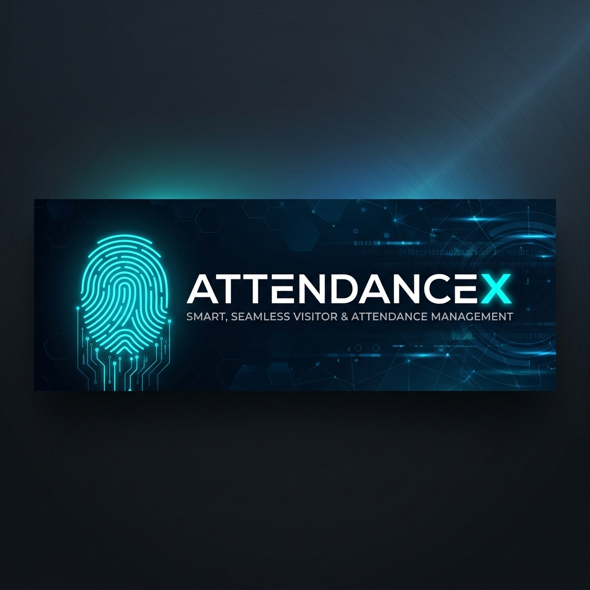
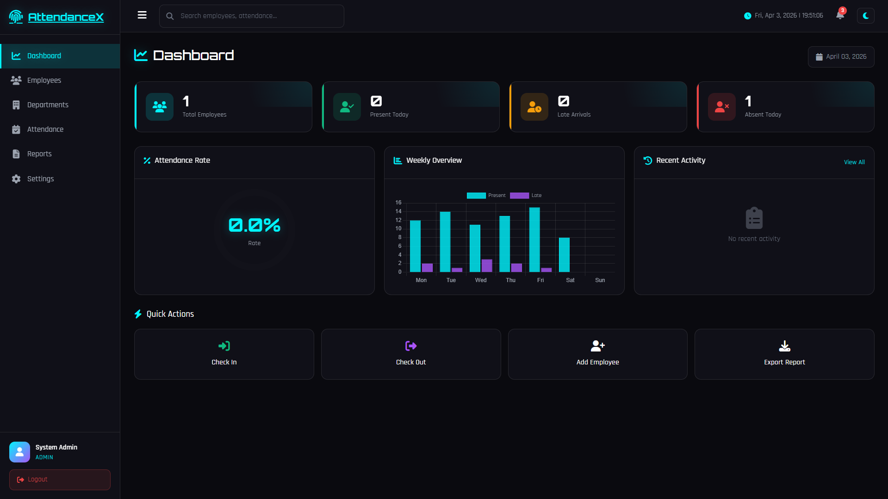
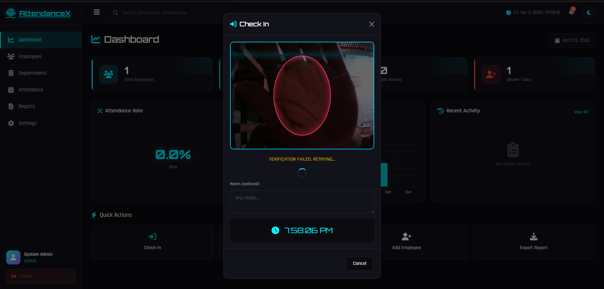

<div align="center">

NOTE: This is still under development!!!



# 🕒 AttendanceX
### Modern Employee Attendance & Management System

[](LICENSE)
[](https://www.python.org/)
[](https://www.djangoproject.com/)
[](https://github.com/Fr4udgrammer/attendance_system)

[**Explore Docs**](SYSTEM_MANUAL.md) • [**Report Bug**](https://github.com/Fr4udgrammer/attendance_system/issues) • [**Request Feature**](https://github.com/Fr4udgrammer/attendance_system/issues)

</div>

---

## 📖 Table of Contents
- [✨ Key Features](#-key-features)
- [🛠️ Tech Stack](#️-tech-stack)
- [🚀 Quick Start](#-quick-start)
- [📁 Project Structure](#-project-structure)
- [🗺️ Roadmap](#️-roadmap)

---

## ✨ Key Features

<details open>
<summary><b>📊 Dynamic Dashboard</b></summary>
<br>
Get real-time insights into employee attendance, late arrivals, and absence rates with our modern dark-themed dashboard.
<br><br>

</details>

<details>
<summary><b>👤 Face Recognition Support</b></summary>
<br>
Seamless check-in/out experience with optional face profile verification for enhanced security.
<br><br>

</details>

<details>
<summary><b>📋 Comprehensive Reporting</b></summary>
<br>
- Detailed attendance history and summaries.
- Exportable data for administrative purposes.
- Department-wise analytics.
</details>

<details>
<summary><b>📱 Responsive UI</b></summary>
<br>
Fully optimized for mobile, tablet, and desktop with a collapsible sidebar and intuitive navigation.
</details>

---

## 🛠️ Tech Stack

<div align="center">


</div>

---

## 🚀 Quick Start

<details>
<summary><b>1. Installation (Windows/Linux/macOS)</b></summary>

### Prerequisites
- Python 3.10+
- pip
- git

### Setup Steps
```bash
# Clone the repository
git clone https://github.com/Fr4udgrammer/attendance_system.git
cd attendance_system

# Create virtual environment (Windows)
python -m venv .venv
.venv\Scripts\activate

# Install dependencies
pip install -r requirements.txt

# Migrate Database
python manage.py migrate
```
</details>

<details>
<summary><b>2. Running the Application</b></summary>

```bash
# Create admin access
python manage.py createsuperuser

# Start development server
python manage.py runserver
```
Visit `http://127.0.0.1:8000/` to start monitoring.
</details>

<details>
<summary><b>3. Docker Implementation</b></summary>

```bash
docker-compose up --build
```
</details>

---

## 📁 Project Structure

```bash
attendance_system/
├── apps/               # core applications (accounts, employees, attendance, reports)
├── media/              # uploaded employee face profiles
├── static/             # global CSS, JS, and Images
├── templates/          # global HTML templates
├── manage.py           # django management script
└── requirements.txt    # python dependencies
```

---

## 🗺️ Roadmap

- [x] Base Attendance System
- [x] Modern Dark Mode Dashboard
- [x] Mobile Responsive Layout
- [/] Advanced Face Liveness Detection
- [ ] Email Notifications for Late Arrivals
- [ ] Multi-tenant Support for Multiple Companies

---

<div align="center">
Made with ❤️ by Ryan Gwapo🤣
</div>
